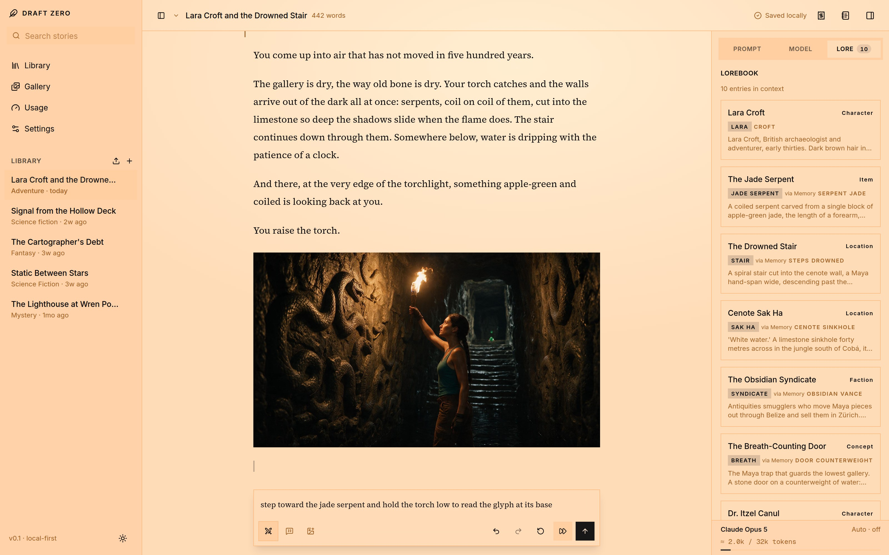
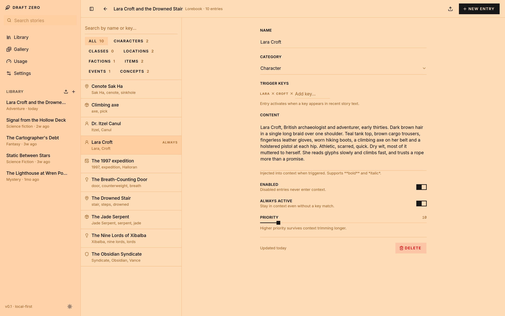

<picture>
  <source media="(prefers-color-scheme: dark)" srcset="docs/screenshots/hero-dark.jpg">
  
</picture>

# draft zero

An AI-assisted interactive fiction app you run yourself. Bring an
[OpenRouter](https://openrouter.ai) key and write with any model; the
manuscript, the lorebook and the pictures stay in your own Postgres.

It grew out of wanting what NovelAI and AI Dungeon do well — a lorebook that
fires on its own, Do and Say turns, a manuscript that reads like a book rather
than a chat — without a subscription, a fixed model list, or a story that lives
on somebody else's server. Then it kept going: a picture is a beat in the story,
the room takes on the story's colour, and every open device shows the same
sentence being written at the same moment.

## What it does

**Writing.** Type in first person and it lands on the page in second: a Do
becomes *You shove the door with your shoulder.* and a Say becomes *You say,
"Who's down there?"* Every generated passage is a take — retry it, under the
same model or a different profile, and flip between the versions. Rewind to any
passage, undo and redo across turns, edit anything in place, and read in a
focus mode that folds the chrome away.

**Memory that keeps up.** A per-story lorebook with trigger keys, categories
and priorities; entries can cascade, so a card that mentions another pulls it
in too. As a long manuscript slides out of the context window, a rolling
summary is written just before the prose falls off, so the model never loses
the plot. Every passage keeps a record of exactly what the model was shown to
write it — memory, lore, summary, manuscript — and you can open it.

**Any model, on your terms.** Pick from the whole OpenRouter catalog, with
thinking levels where the model has them. Pin the provider that serves it, with
live speed, price, context window and quantization on each row. Save the
settings you like as model profiles and switch a story between them. Turn on
zero data retention for the app, a profile or a story, and the pickers grey out
every endpoint that would keep your prompts.

**Pictures as beats.** Switch the composer to image mode and type a lazy brief
— *Lara at the cave mouth, torch raised*. The story's own model develops it
into a full prompt, resolving names against your lorebook cards so the image
model gets her braid and her teal tank top instead of her name; you can mute a
card with a tap, or skip the assist and send your words verbatim. The picture
lands in the manuscript where the story is, keeps its takes like a passage,
can be redrawn under another image model, and every draw in the library shows
up in the gallery.

**Atmosphere.** A story tints the room it is read in, in light and dark alike.
Left on auto, the tint follows the story: after each turn a small call decides
whether the scene has moved and picks one of eight named colours.

**Magic sync, magic resume.** A generation is owned by the server, not the tab
that started it. Open the same story on a phone while the desktop is
mid-sentence and the phone lands at the same word and keeps going. Switch apps,
lock the phone, lose the connection, come back: it reattaches to the run and
catches up. The draft in the composer, the mode you had armed, the model you
picked in the inspector, a half-developed image prompt — all of it follows you
from device to device, and a control never fights the hand that is editing it.

**Import.** NovelAI `.scenario` files, AI Dungeon story-card exports, and whole
AI Dungeon backups, adventure and all. The picker sniffs the file; the dialog
lists whatever it could not carry over before you commit.

**Spend.** Every call is in a ledger, so a passage and a picture each carry
what they cost, and the usage page breaks it down by day, by model, and by
image model.

**Automate it.** An MCP endpoint at `/api/mcp` exposes the library to any MCP
client — Claude Code, Codex, Claude Desktop — with fourteen tools: read
passages, search, write and rewind, manage lore, and see what a passage was
actually shown. See [docs/mcp.md](docs/mcp.md).

## Lorebook

<picture>
  <source media="(prefers-color-scheme: dark)" srcset="docs/screenshots/lorebook-dark.jpg">
  
</picture>

Entries have a name, a category, trigger keys, content and a priority. Matching
is case-insensitive substring over the recent manuscript, memory and the
author's note; an entry can also be always active. Triggered entries can
cascade, and the inspector's Lore tab says why each card is in context and what
brought it there. Higher priority survives context trimming longer, and the
lore budget is a generation setting.

## Quick start

Requires [bun](https://bun.sh) and Docker.

```bash
docker compose up -d         # Postgres 17 on 127.0.0.1:5433
bun install
cp .env.example .env.local
bun run db:migrate
bun run dev
```

Open http://localhost:3000, paste an OpenRouter key on the Settings page (or
put it in `.env.local` as `OPENROUTER_API_KEY`), and start a story. Without a
key, generation runs on an offline mock provider so the app can be explored for
free. With [`just`](https://just.systems) installed the block above is `just
setup` then `just dev`.

To run everything in Docker instead:

```bash
docker compose --profile app up --build
```

[docs/setup.md](docs/setup.md) covers the database options, migrations, the
Docker images and every environment variable.

## Stack

Next.js 16 App Router, React 19, Tailwind v4, shadcn on `@base-ui/react`,
Drizzle ORM on Postgres. OpenRouter for text and image generation. bun as the
package manager and test runner.

## Docs

- [Setup](docs/setup.md) — database, Docker, migrations, scripts, layout
- [Do and Say](docs/do-and-say.md) — how a first-person turn becomes prose
- [Provider routing](docs/provider-routing.md) — pinning a host, zero data
  retention
- [Importing](docs/importing.md) — NovelAI and AI Dungeon, in detail
- [MCP](docs/mcp.md) — connecting Claude Code, Codex or Claude Desktop, and
  the fourteen tools

## License

[MIT](LICENSE)
